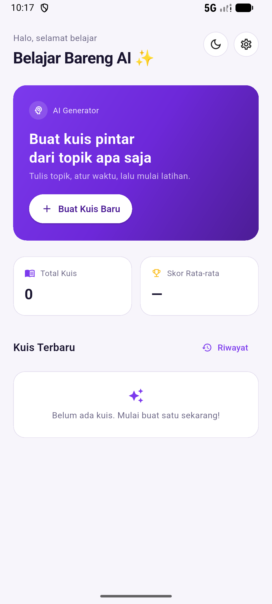
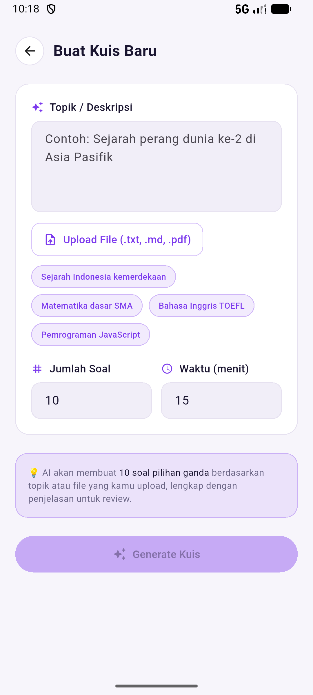

# Belajar Bareng AI

Aplikasi latihan soal pilihan ganda berbasis AI untuk Android, iOS, dan Web. Tulis topik yang ingin dipelajari, dan aplikasi akan men-generate soal lewat AI, menyimpannya secara lokal, lalu membiarkanmu mengerjakannya kapan saja — **bahkan tanpa internet**.

[](https://flutter.dev)
[](LICENSE)
[](#kontribusi)

> Proyek ini terbuka untuk siapa saja. Baik kamu pelajar yang ingin belajar, developer yang ingin berkontribusi, atau pengajar yang ingin memakai aplikasi ini di kelas — kamu dipersilakan.

---

## Daftar Isi

- [Fitur](#fitur)
- [Cara Kerja](#cara-kerja)
- [Tangkapan Layar](#tangkapan-layar)
- [Persyaratan](#persyaratan)
- [Instalasi](#instalasi)
- [Menjalankan Aplikasi](#menjalankan-aplikasi)
- [Konfigurasi AI Provider](#konfigurasi-ai-provider)
- [Struktur Proyek](#struktur-proyek)
- [Arsitektur](#arsitektur)
- [Pengembangan](#pengembangan)
- [Kontribusi](#kontribusi)
- [Roadmap](#roadmap)
- [Lisensi](#lisensi)

---

## Fitur

- **Generate soal instan** — masukkan deskripsi topik, jumlah soal, dan durasi; AI menyusun soalnya dalam hitungan detik.
- **Offline-first** — soal, riwayat, dan hasil disimpan di database lokal (Hive). Hanya proses generate yang butuh internet.
- **Timer global** — simulasi ujian dengan countdown total waktu; kuis otomatis ter-submit saat waktu habis.
- **Review pembahasan** — setiap soal punya penjelasan jawaban benar, jadi kamu belajar dari kesalahan.
- **Riwayat lengkap** — semua kuis yang pernah dibuat tersimpan rapi dan bisa dikerjakan ulang.
- **Multi-provider AI** — dukung OpenAI-compatible API dan Anthropic, lengkap dengan konfigurasi base URL dan model sendiri.
- **API key aman** — kredensial disimpan lewat `flutter_secure_storage`, bukan di dalam kode.
- **Tanpa login** — tidak ada akun, tidak ada server, data tetap di perangkatmu.
- **Material 3 + dark mode** — UI bersih dan responsif di berbagai ukuran layar.

## Cara Kerja

```
┌──────────────┐     ┌──────────────┐     ┌──────────────┐
│  Create Quiz │ ──▶ │  AI Provider │ ──▶ │  Hive (lokal) │
│  (topik,     │     │  (OpenAI /   │     │  soal + kuis  │
│   jumlah,    │     │   Anthropic) │     └──────┬───────┘
│   durasi)    │     └──────────────┘            │
└──────────────┘                                 ▼
                                        ┌──────────────┐
                                        │ Quiz Runner  │
                                        │ (timer)      │
                                        └──────┬───────┘
                                               ▼
                              ┌────────────────────────────┐
                              │ Result ──▶ Review ──▶ History │
                              └────────────────────────────┘
```

1. Kamu isi form topik → app menyusun prompt terstruktur dan mengirimnya ke provider AI pilihanmu.
2. AI membalas JSON berisi pertanyaan, 4 opsi, indeks jawaban benar, dan penjelasan.
3. Soal disimpan ke Hive, lalu sesi pengerjaan dimulai dengan timer.
4. Setelah submit (atau waktu habis), skor ditampilkan dan bisa langsung direview.
5. Semua tersimpan di riwayat — dapat dikerjakan ulang sepenuhnya offline.

## Tangkapan Layar

| Beranda | Buat Kuis Baru |
| :---: | :---: |
|  |  |

## Persyaratan

| Kebutuhan | Versi |
|---|---|
| Flutter SDK | `>= 3.0.0 < 4.0.0` |
| Dart SDK | `>= 3.0.0 < 4.0.0` |
| Android | API 21+ (minSdk bawaan Flutter) |
| iOS | iOS 12+ |
| Web | Browser modern (butuh flag CORS, lihat catatan di bawah) |

Cek instalasimu dengan:

```bash
flutter doctor
```

## Instalasi

```bash
# 1. Clone repositori
git clone https://github.com/<username>/belajar-bareng-ai.git
cd belajar-bareng-ai

# 2. Ambil dependency
flutter pub get

# 3. Generate adapter Hive (wajib, file *.g.dart tidak di-commit)
flutter pub run build_runner build --delete-conflicting-outputs
```

> **Penting:** model Hive memakai `hive_generator`. Jika kamu baru mengubah model di
> [lib/app/data/models/](lib/app/data/models/), jalankan ulang langkah 3.

## Menjalankan Aplikasi

```bash
# Android / iOS
flutter run

# Web (lihat catatan CORS di bawah)
flutter run -d chrome
```

### Catatan untuk Web

Panggilan langsung ke API AI dari browser akan diblokir oleh CORS. Untuk pengujian lokal:

```bash
flutter run -d chrome --web-browser-flag "--disable-web-security"
```

Jangan gunakan flag ini untuk produksi. Untuk deployment web, sediakan proxy backend yang meneruskan request ke provider AI.

## Konfigurasi AI Provider

Buka tab **Pengaturan** di aplikasi, lalu isi:

| Field | Keterangan |
|---|---|
| **Provider** | `OpenAI` (kompatibel dengan endpoint OpenAI-style) atau `Anthropic` |
| **Base URL** | Contoh: `https://api.openai.com/v1` atau `https://api.anthropic.com/v1` |
| **Model** | Contoh: `gpt-4o-mini`, `claude-3-5-sonnet` |
| **API Key** | Kunci API milikmu — disimpan terenkripsi di secure storage perangkat |

Tekan **Test Connection** untuk memverifikasi konfigurasi sebelum membuat kuis.

Karena `baseUrl` dapat dikonfigurasi, kamu juga bisa mengarahkannya ke gateway
OpenAI-compatible lain (mis. LiteLLM, OpenRouter, atau server lokal seperti Ollama
dengan adapter OpenAI).

> **Jangan pernah** men-commit API key ke repositori ini. Aplikasi membaca key dari
> input pengguna lalu menyimpannya di `flutter_secure_storage` (SharedPreferences di web).

## Struktur Proyek

```
lib/
├── main.dart                        # Bootstrap: Hive, repository, settings
└── app/
    ├── core/
    │   ├── theme/                   # app_theme.dart, app_colors.dart
    │   └── widgets/                 # widget bersama (card, tombol, shell mobile)
    ├── data/
    │   ├── models/                  # Quiz, Question, QuizResult (+ *.g.dart Hive)
    │   ├── providers/               # AiProvider, OpenAiProvider, AnthropicProvider
    │   ├── repositories/            # QuizRepository (Hive)
    │   └── services/                # SettingsService (provider, model, API key)
    ├── modules/                     # satu folder per layar (GetX)
    │   ├── home/                    # daftar & pintu masuk pembuatan kuis
    │   ├── create_quiz/             # form topik, jumlah soal, durasi
    │   ├── quiz_runner/             # pengerjaan + timer global
    │   ├── result/                  # skor & ringkasan
    │   ├── review/                  # pembahasan per soal
    │   ├── history/                 # riwayat kuis
    │   └── settings/                # provider, model, base URL, API key
    └── routes/                      # app_pages.dart, app_routes.dart
specs/
└── PRD.md                           # Product Requirements Document
```

## Arsitektur

| Layer | Teknologi |
|---|---|
| UI | Flutter, Material 3 |
| State Management | GetX (`GetxController`, `Obx`) |
| Routing | GetX Routing (`GetPage`) |
| Database lokal | Hive |
| HTTP client | Dio |
| Secure storage | flutter_secure_storage |

Setiap layar mengikuti pola GetX **View / Controller / Binding**, dan seluruh akses AI
berada di balik abstraksi [`AiProvider`](lib/app/data/providers/ai_provider.dart) —
menambah provider baru cukup dengan mengimplementasikan interface tersebut dan
mendaftarkannya di [`SettingsService.buildProvider()`](lib/app/data/services/settings_service.dart).

## Pengembangan

```bash
flutter pub get                 # ambil dependency
flutter analyze                 # static analysis
flutter test                    # jalankan unit & widget test
flutter format .                # rapikan format
```

Setelah mengubah model Hive:

```bash
flutter pub run build_runner build --delete-conflicting-outputs
```

Spec produk lengkap ada di [specs/PRD.md](specs/PRD.md).

## Kontribusi

Kontribusi dalam bentuk apa pun diterima: laporan bug, ide fitur, perbaikan dokumentasi,
maupun pull request.

1. Fork repositori ini.
2. Buat branch baru: `git checkout -b feat/nama-fitur` atau `fix/nama-bug`.
3. Tulis kode mengikuti gaya yang sudah ada, dan pastikan `flutter analyze` bersih.
4. Tambahkan test jika memungkinkan.
5. Commit dengan pesan yang jelas, lalu push dan buka pull request.

**Sebelum membuka PR, pastikan:**

- [ ] `flutter analyze` tidak menghasilkan error.
- [ ] `flutter test` lulus.
- [ ] Tidak ada API key, token, atau kredensial yang ikut ter-commit.
- [ ] Perubahan pada model Hive disertai hasil regenerasi `build_runner`.

Kamu juga bisa berkontribusi tanpa menulis kode — misalnya menambahkan screenshot,
menerjemahkan dokumentasi, atau menuliskan contoh prompt yang bagus.

## Roadmap

- [ ] Dukungan tema terang/gelap yang bisa diikuti sistem
- [ ] Timer per soal (opsional)
- [ ] Tipe soal selain pilihan ganda (isian singkat, benar/salah)
- [ ] Ekspor & impor bank soal (JSON)
- [ ] Widget progres belajar dan statistik per topik
- [ ] Integrasi speech-to-text untuk membuat soal dari rekaman kuliah

## Lisensi

Didistribusikan di bawah **MIT License**. Lihat file [LICENSE](LICENSE) untuk teks lengkapnya.

## Penghargaan

Dibuat dengan [Flutter](https://flutter.dev), [GetX](https://pub.dev/packages/get),
[Hive](https://pub.dev/packages/hive), dan [Dio](https://pub.dev/packages/dio).
Terima kasih kepada semua kontributor dan siapa pun yang belajar bersama proyek ini.
